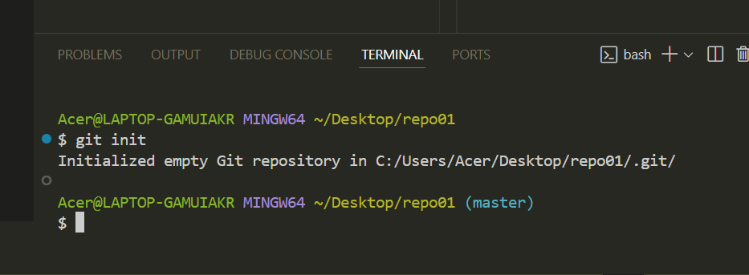

# Ejercicio 1
## 1.1
Creamos el repositorio mediante la creación de una carpeta, abrimos la terminal y escribios `git init`.  
Para ver que el repositorio se ha inicializado correctamente, podemos observar que pone `(master)` en la terminañ.

## 1.2
Creamos el archivo `readme.md`.

## 1.3
Hacemos `git add .` para añadir los cambios al "staging area" y visualizamos el estado del repositorio con `git status`. Finalmente creamos el commit. El "file status lifecycle" que se encuentra es "staged".

## 1.4 